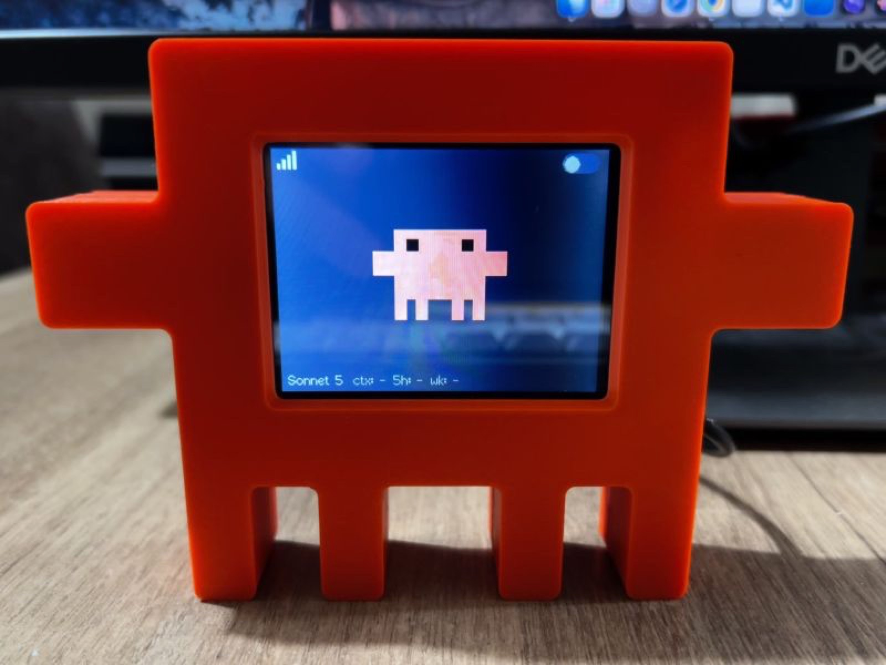

# clawdesk

**A physical desk mascot for Claude Code.** It sits next to your monitor, watches
your Claude Code session over the network, and reacts — hacking away while a tool
runs, celebrating your commits, sulking when something fails, and showing your
5-hour/weekly quota at a glance.

<p align="center">
  
</p>

Runs on a **CYD** (ESP32-2432S028R, "Cheap Yellow Display") — a $10-15 board with a
built-in 2.8" touchscreen. The 3D-printed enclosure was modeled with **Fable 5** and
printed by [yazdirgelsin.com](https://yazdirgelsin.com). No soldering required
beyond what the board already has.

## Why

Claude Code runs in a terminal you're not always looking at. clawdesk turns its
event stream into something ambient — a glance at a physical object on your desk
tells you whether it's thinking, working, done, or stuck, without switching
windows.

## Features

- **14 expression animations** plus a row of wandering mini mascots, 64×64 RGB565,
  scaled 3× onto the landscape display, each at its own frame rate (`src/anims/`).
  Open the **[mascot showcase](docs/showcase.html)** in a browser to see them all
  play; regenerate it from `src/anims/*.h` with `python3 tools/build_showcase.py`.
- **Live quota HUD** — current 5-hour and weekly usage percentage, with reset
  countdowns, right on the screen.
- **Event protocol** — `POST /e` (fire-and-forget, 204), with events mapped to
  animations (`tool.pre`→hacking, `git`→happy, `think`→think,
  `tool.post ok=false`→oops, …). `GET /health` for liveness. mDNS `clawd.local`
  works on the device but is only for discovery/fallback — the PC integration
  (`install.sh`) always uses a **static IP**, because mDNS delays or drops event
  delivery on some networks.
- **Power management** (`src/power.h`):

  | State  | Trigger             | Behavior |
  |--------|----------------------|----------|
  | ACTIVE | event or touch       | Full brightness, animation playing |
  | DIM    | 20 s with no events  | Backlight ~11% (soft fade), animation keeps playing |
  | SLEEP  | 90 s with no events  | Screen off, animation stopped, CPU 80 MHz, WiFi modem-sleep |

  **Waking:** an incoming `POST /e` packet (the WiFi association is held, so the
  packet wakes the CPU) or a touch → an instant fade to full brightness + 240 MHz +
  animation. Thresholds and brightness levels live in `include/config.h`.

## Hardware

| | |
|---|---|
| Board | ESP32-2432S028R ("CYD" — Cheap Yellow Display), 2.8" ILI9341 + XPT2046 touch |
| Enclosure | 3D-printed, designed in **Fable 5**, printed by [yazdirgelsin.com](https://yazdirgelsin.com) |
| Connectivity | WiFi (station mode), static IP recommended |
| Cost | ~$10-15 for the board |

The `clawd-cyd-guide.md` in this repo covers board quirks (dead red LED channel on
some units, pinout, flashing over USB) if you're sourcing your own.

## Installation (from scratch, one command)

Whoever picks up the device runs one script; it asks for what it needs and does the
rest:

```sh
./install.sh
```

In order, it: writes your WiFi credentials to `include/secrets.h` → **auto-detects
the gateway/subnet of the network you are on and assigns the device a mandatory
static IP** (so event delivery never suffers from mDNS/DHCP delay or a changing
address — it asks, but the step cannot be skipped; you only confirm or adjust the
suggested values) → flashes the device over USB → installs the clawd plugin
**globally** on this machine (`claude plugin install clawd@clawd --scope user`, so
it is active in every project, not just this repo) → wires up the statusLine HUD
bridge (the same thing `/clawd:clawd-statusline` does) → syncs the spinner word pool
to the device. Re-running it is harmless (idempotent); the flash/plugin/statusLine/
spinner steps are skippable, the static IP step is not.

When you change networks (coming home, switching to a hotspot), just run
`./install.sh` again — it detects the new gateway/subnet and rewrites the static IP
accordingly.

**To revert, or to hand the device to someone else:**

```sh
./uninstall.sh
```

This removes the global plugin, the statusLine bridge and the `CLAWD_HOST` setting
from this machine. It does **not restore a previous static IP — it disables the
feature** (`CLAWD_STATIC_IP` → 0, the device falls back to DHCP) and deletes
`include/secrets.h` (after asking). The device's firmware is untouched; unplugging
it is enough.

## Manual / advanced setup

The steps `install.sh` performs, if you would rather run them yourself:

```
platformio.ini        huge_app partition (the animations + network stack do not fit 1.25MB)
include/config.h      all tunable constants (pins, timings, brightness, static IP)
include/secrets.h     WiFi credentials (gitignored)
src/main.cpp          setup/loop: WiFi + server + animation + power
src/power.h           PowerManager: two idle stages + backlight fade
src/anims.h           animation registry (fps, transience, LED color)
src/anims/clawd_*.h   frame data generated with PixelLab
tools/clawd-plugin/   the Claude Code plugin (hooks → POST /e, statusLine, spinner)
```

Write your WiFi credentials to `include/secrets.h` (`WIFI_SSID`/`WIFI_PASS`). For a
static IP (recommended, see above) set `CLAWD_STATIC_IP` and
`IP_LOCAL`/`IP_GATEWAY`/`IP_SUBNET`/`IP_DNS` in `include/config.h` to match your
network. Then build and upload:

```sh
SSL_CERT_FILE=~/.platformio/system-ca-bundle.pem REQUESTS_CA_BUNDLE=~/.platformio/system-ca-bundle.pem \
  ~/.platformio/penv/bin/pio run -t upload --upload-port /dev/cu.usbserial-XXXX
```

For the Claude Code integration, see
`tools/clawd-plugin/plugins/clawd/README.md`. You will need to write `CLAWD_HOST`
into the global `~/.claude/settings.json` yourself (`install.sh` does it for you).

Testing (`<device-ip>` is the device's real IP; find it with
`jq '.env.CLAWD_HOST' ~/.claude/settings.json`):
```sh
curl http://<device-ip>/health
curl -X POST http://<device-ip>/e -H 'Content-Type: application/json' -d '{"k":"git","d":{"s":"commit"}}'
```

## Project layout

```
clawdesk/
├── src/                     # ESP32 firmware (PlatformIO) — animations, power, HTTP server
├── include/                 # config.h (tunables) + secrets.h (gitignored)
├── tools/
│   ├── pixellab/            # animation authoring pipeline (PixelLab → C header)
│   ├── build_showcase.py    # regenerates docs/showcase.html
│   └── clawd-plugin/        # the Claude Code plugin (hooks → POST /e)
├── examples/                # step-by-step CYD exploration (01-hello-world … 09-clawd-anim)
├── docs/                    # mascot showcase, images
├── install.sh / uninstall.sh
└── clawd-*.md               # architecture, device protocol, hardware guide, ideas backlog
```

> `examples/` is how the device's capabilities were explored incrementally; this
> root project is the real application.

## Documentation

- [`clawd-architecture.md`](clawd-architecture.md) — hook + firmware architecture
- [`clawd-device-protocol.md`](clawd-device-protocol.md) — the `POST /e` event schema
- [`clawd-cyd-guide.md`](clawd-cyd-guide.md) — CYD board notes and quirks
- [`clawd-device-ideas.md`](clawd-device-ideas.md) — backlog of future ideas

## License

No license file yet — all rights reserved by default. Open an issue if you'd like
to use this and licensing isn't clear.
